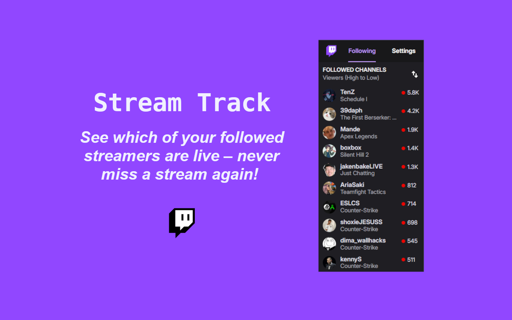
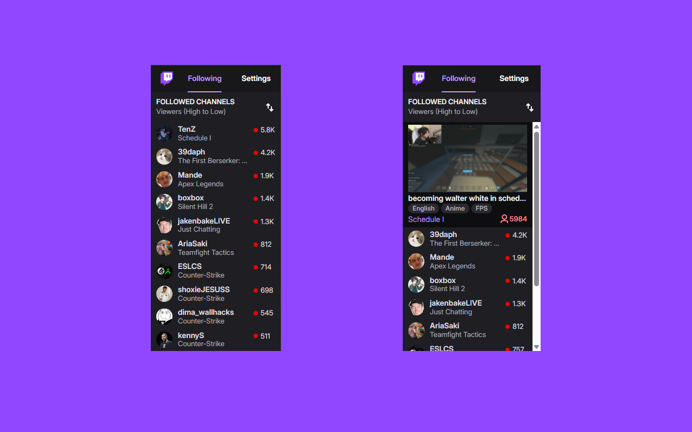
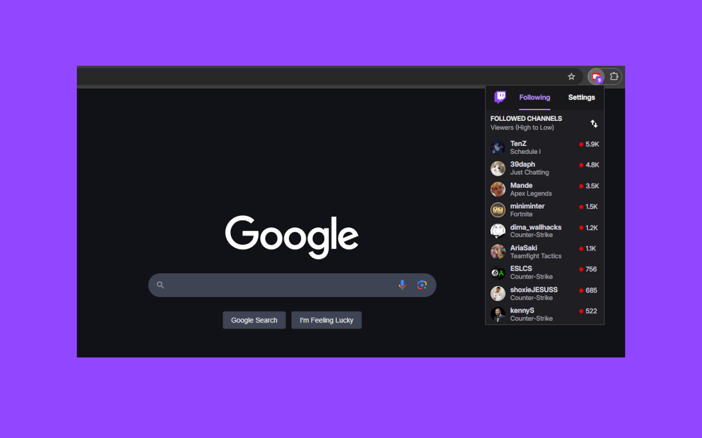

  <h1 align="center">Stream Track</h1>

  

  
Table of Contents

  <ol>
    <li><a href="#about">About</a></li>
    <li><a href="#Installation">Installation</a></li>
    <li><a href="#features">Features</a></li>
  </ol>

Stream Track is a Chrome extension that helps Twitch users track the live streaming status of their followed streamers. It provides a convenient way to stay updated on the streaming activities of your favorite streamers.

  
  
  

  

  <h2>Installation</h2>

  <ol>
    <li>
      Click  <a href="https://chromewebstore.google.com/detail/stream-track/gefllgcgjeonfffgimbgfkpkpckhppdg" target="_blank">here</a> or go to <a href="https://chromewebstore.google.com/" target="_blank">Chrome Web Store</a> and search "Stream Track".
    </li>
    <li>
      Click "Add to Chrome" to install the extension.
    </li>
    <li>
      Confirm the installation by clicking "Add Extension"
    </li>
    <li>
      Once installed, click the extension icon in the Chrome toolbar and pin the extension to your toolbar.
    </li>
    <li>
      Click the  icon, go to the settings tab and login to your twitch.
    </li>
  </ol>

  <h2>Features</h2>

  <ul>
    <li>
      Real-Time Live Streamer List
      - Display a list of currently live Twitch streamers.
    </li>
    <li>
      Twitch Account Integration - Allow user to login to their Twitch account to track their followed streamers.
    </li>
    <li>Easy Access to Live Streams - Quickly see who is live from the chrome toolbar.</li>
  </ul>

